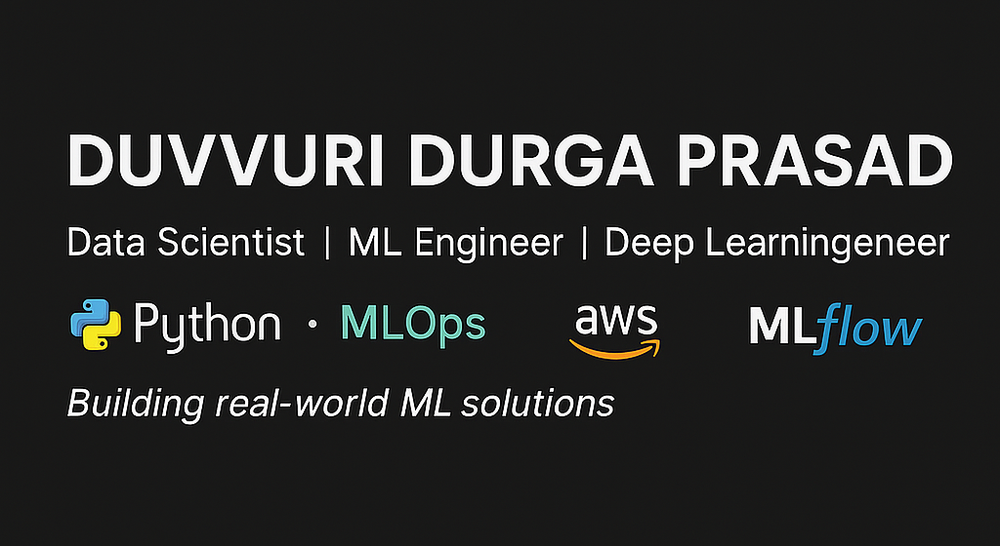

  <h3 style="color:#2a9d8f; font-weight:700;">Welcome to my portfolio! Here's a quick overview of what you'll find 👇</h3>

  

---

# Duvvuri Durga Prasad – Data Science Portfolio
• Data Scientist • MLOps Practitioner • Machine Learning Engineer • Deep Learning Engineer

Welcome to my data science portfolio! I'm **Duvvuri Durga Prasad**, an aspiring **Data Scientist, MLOps Practitioner, and Machine Learning Engineer** with hands-on experience deploying end-to-end ML solutions using modern tools and frameworks.

---

## About Me

* **PG Diploma in Data Science & AI** from the University of Liverpool  
* Background in **Mechanical Engineering** with a strong transition to tech  
* Passionate about **clean code**, **automation**, and **data ethics**  
* Continuously learning and growing in the fields of **ML**, **MLOps**, and **Cloud AI**

---

## 📁 Table of Contents

- [Duvvuri Durga Prasad – Data Science Portfolio](#duvvuri-durga-prasad--data-science-portfolio)
  - [About Me](#about-me)
  - [📁 Table of Contents](#-table-of-contents)
  - [Education \& Certifications](#education--certifications)
  - [Projects](#projects)
    - [NLP Projects](#nlp-projects)
    - [MLOps \& Deployment Projects](#mlops--deployment-projects)
    - [Predictive Modeling Projects](#predictive-modeling-projects)
    - [Data Analysis \& EDA](#data-analysis--eda)
  - [Featured Projects](#featured-projects)
  - [Technical Skills](#technical-skills)
  - [Soft Skills](#soft-skills)
  - [Resume](#resume)
  - [Contact Me](#contact-me)

---

## Education & Certifications

- **Post Graduate Diploma in Data Science and Artificial Intelligence**  
  University of Liverpool, UK | Dec 2024  
  Focus: Machine Learning, Deep Learning, AI, NLP, Data Visualization  
  Dissertation: Developed a Python-based 2D strategy game using graph theory.

- **Bachelor of Technology in Mechanical Engineering**  
  Avanthi Institute, Hyderabad | May 2017  
  Project: Solar-powered car prototype focusing on sustainable energy design.

- **Courses & Certifications:**  
  - Machine Learning with Python: Zero to GBMs (Aug 2023 – Feb 2024)  
  - Data Analysis with Python: Zero to Pandas (May 2022 – Aug 2022)

---

## Projects

### NLP Projects

* **Movie Recommender System**  
  Content-based recommendation engine using metadata and cosine similarity.  
  👉 Deployed with **Streamlit**, integrates **TMDB API**.

### MLOps & Deployment Projects

* **Credit Score Classification**  
  Full MLOps pipeline using **DVC**, **MLflow**, **Flask**, **Docker**, and **AWS EC2**.  
  CI/CD automation via GitHub Actions.

### Predictive Modeling Projects

* **Student Performance Prediction** – Deployed with Streamlit  
* **Loan Prediction Web App** – Flask app using SQLite  
* **Heart Disease Prediction** – Multi-model classifier including XGBoost  
* **Breast Cancer Detection** – Flask + Random Forest for medical prediction  
* **Prudential Life Insurance Assessment** – Logistic Regression & Feature Engineering

### Data Analysis & EDA

* **NYC Restaurant Analysis & Recommendation System**  
  Exploratory data analysis using Pandas, Plotly, Seaborn.

---

## Featured Projects

| Project                     | Highlights                                            |
| --------------------------- | ---------------------------------------------------- |
| **Movie Recommender System**    | Real-time suggestions, poster fetching, NLP + Streamlit |
| **Credit Score Classification** | Enterprise-ready MLOps pipeline, DVC, Docker, AWS       |
| **Loan Approval App**           | Flask + Bootstrap, form validation, SQLite integration  |
| **Heart Disease Predictor**     | 86.8% accuracy, XGBoost, Flask interface                |
| **Breast Cancer Detector**      | 95.6% accuracy, real-time health prediction             |

---

## Technical Skills

- **Languages & Tools:** Python (Advanced), SQL, HTML, CSS, Excel  
- **ML Frameworks:** Scikit-learn, XGBoost, TensorFlow, Keras  
- **Data Handling:** Pandas, NumPy, SciPy  
- **Web & Deployment:** Flask, Streamlit, Docker, FastAPI (Basic), Render  
- **MLOps:** DVC, MLflow, Git, GitHub Actions, CI/CD, Linux CLI  
- **Cloud:** AWS EC2 (Deployed Projects), Azure & GCP (Learning)  
- **Visualization:** Matplotlib, Seaborn, Plotly, Power BI  
- **Databases:** MySQL, SQLite  
- **Version Control:** Git, GitHub  
- **Domains:** NLP, LLMs, EDA, Feature Engineering, Data Preprocessing

---

## Soft Skills

* Clear Communicator  
* Proactive & Self-Motivated  
* Problem Solver  
* Collaborative Team Player  
* Fast Learner with Growth Mindset

---

## Resume

[Download Resume](docs/DuvvuriDurgaPrasad_Resume.pdf)  
[View PDF](docs/DuvvuriDurgaPrasad_Resume.pdf)

---

## Contact Me

I’m currently open to new opportunities in Data Science, MLOps, or Machine Learning Engineering.

* 📧 **Email:** [satyadurgaprasad28@gmail.com](mailto:satyadurgaprasad28@gmail.com)  
* 🌐 **LinkedIn:** [linkedin.com/in/duvvuri-durga-prasad-dp](https://www.linkedin.com/in/duvvuri-durga-prasad-dp)  
* 💼 **Portfolio Website:** [duvvuridurgaprasad28.github.io](https://duvvuridurgaprasad28.github.io/)
* 💻 **GitHub:** [github.com/Duvvuridurgaprasad28](https://github.com/Duvvuridurgaprasad28)

---

> **Let’s build intelligent solutions that scale and deliver impact!**

© 2025 Duvvuri Durga Prasad

---
